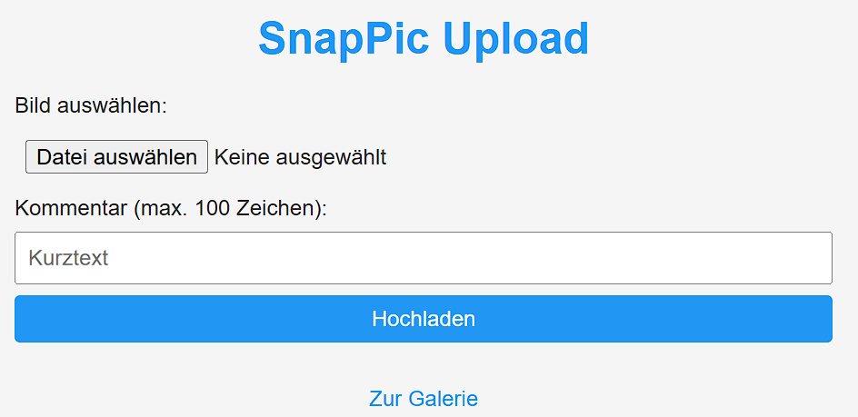

# SnapPic

SnapPic is a Flask-based Progressive Web App (PWA) that lets users upload images with comments from their mobile devices and view them in a time-limited fading gallery.

## Screenshots

### Upload Interface



### Gallery View


## Features

- Mobile-first responsive design using vanilla HTML, CSS, and JavaScript
- PWA support with manifest and service worker for offline use
- Image uploads (JPG, PNG, WEBP) with optional comments (max. 100 characters)
- Images are visible for 5 seconds, fade out over 10 seconds, then automatically deleted
- Gallery auto-refreshes every 2 seconds
- Metadata stored in `data.json`; images stored in `uploads/` folder
- Max 5 MB per image; max 10 images displayed (FIFO)

## Requirements

- Python 3.8+
- Flask

Install dependencies:
```bash
pip install -r requirements.txt
```

## Usage

```bash
python app.py
```

Open http://localhost:5000 in your browser or install the PWA on your device.

## Generated with OpenAI Codex
